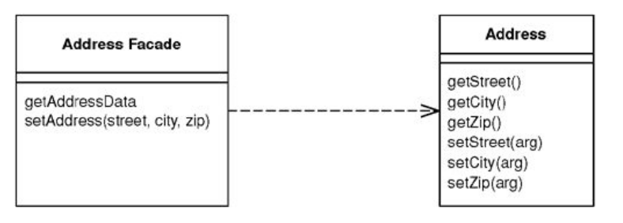
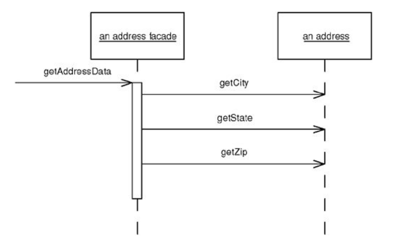
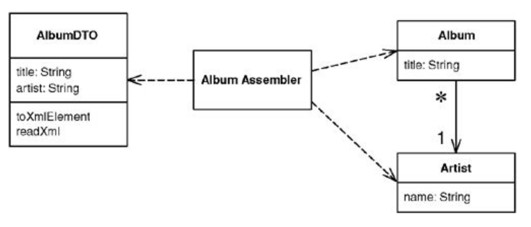
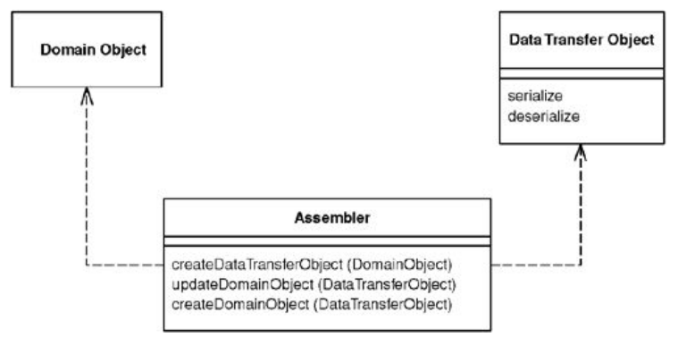

# DISTRIBUTION PATTERNS

Aluno: Lucas Caetano Possatti

======================================

# 1. Remote Facade

======================================

Provê objetos de maior granulação no lugar de objetos com menor granulação, para melhorar a eficiência de comunicação através de uma rede.

======================================



*Exemplo de Remote Facade*

======================================

### Vantagens de objetos de granulação fina (fine-grained)

 - Fácil de revelar a intenção por trás dos nomes de atributos e métodos de um objeto.
 - Maior controle de métodos e objetos menores.
 - Programação facilitada / Maior produtividade.

======================================

### Desvantagens da granulação fina com chamadas inter-processos

 - Para interagir com o objeto, as vezes, são necessárias muitos chamadas a métodos.
 - Chamadas entre processos são muito mais lentas do que chamadas em um mesmo processo.
 - Mesmo com os dois processos no mesmo computador.

======================================



*Como o Remote Facade funciona*

======================================

 - Em casos simples, o Facade pode representar um único objeto.
 - Em casos mais complexos, o Facade pode representar vários objetos.

======================================

### Quando usar o Remote Facade?

 - Quando você precisar de acessar métodos muito granulados remotamente.
 - Mas as vantagens também valem para comunicação inter-processos na mesma máquina.

======================================

### Quando não usá-lo?

 - Quando tudo ocorrer em um único processo.

======================================

## Exemplo de Remote Facade:

======================================

### Classe de endereço anêmica

```
public class Endereco {
	private String cep;
	private String pais;
	private String estado;
	private String cidade;
	private String rua;
	private Integer numero;
	// ... gets e sets.
}
```

======================================

### Enviar dados de endereço

```
public class EnderecoFacade {
	//...
	public void setEndereco(String cep, String pais, String estado, String cidade, String rua, Integer numero) {
		enderecoAtual.setCep(cep);
		enderecoAtual.setPais(pais);
		enderecoAtual.setEstado(estado);
		enderecoAtual.setCidade(cidade);
		enderecoAtual.setRua(rua);
		enderecoAtual.setNumero(numero);
	}
	//...
}
```

======================================

### Obter dados de endereço

```
public class EnderecoFacade {
	//...
	public Map<String, String> getDadosEndereco() {
		HashMap<String, String> dados = new HashMap<String, String>();
		dados.put("cep", enderecoAtual.getCep());
		dados.put("pais", enderecoAtual.getPais());
		dados.put("estado", enderecoAtual.getEstado());
		dados.put("cidade", enderecoAtual.getCidade());
		dados.put("rua", enderecoAtual.getRua());
		dados.put("numero", enderecoAtual.getNumero().toString());
		return dados;
	}
	//...
}
```

======================================

# 2. Data Transfer Object (DTO)

======================================

Um objeto que carrega dados entre processos, para reduzir o número de chamadas a métodos.

======================================



*Exemplo de DTO*

======================================

### O que é DTO?

 - O DTO é um único objeto que contém todos os dados necessários para um determinada chamada.
 - Deve ser serializável.
 - Algumas pessoas na comunidade da Sun chamam esse padrão de "Value Object".

======================================

> "In many ways, a Data Transfer Object is one of those objects our mothers told us never to write."

> "The value of this usually hateful beast is that it allows you to move several pieces of information over a network in a single call — a trick that's essential for
dis tributed systems." <!-- .element: class="fragment" data-fragment-index="1" -->

> — Martin Fowler <!-- .element: class="fragment" data-fragment-index="2" -->

======================================

### Como funciona?

 - Sempre que um objeto remoto precisa de alguns dados, ele chama o DTO mais adequado.
 - É melhor pecar por mais dados do que por menos dados.
 - Ex: Um DTO de pedido provavelmente viria com dados do cliente, itens pedidos, informação de entrega, e etc.
 - Um DTO representa dados usando tipos bem primitivos
 - E conectando objetos que se relacionariam como um grafo simples.
 - Faz sentido projetar um DTO pensando nas necessidades do cliente (Web ou GUI).

=======================================

### Como funciona? ...
 
 - Esse padrão pode ser usado tanto para as requisições quanto para as respostas.
 - Um "Record Set" é um DTO para um BD SQL.
 - Linguagens como Java e C# já vem com meios de serializar o DTO.
 - Uma alternativa é escrever o algoritmo de serialização na mão.
 - É possível usar reflexão para agilizar este último.

=======================================



*Exemplo de Assembler de DTO*

=======================================

### Quando usar DTOs?

 - Sempre que for necessário transferir múltiplos dados entre processos em uma única chamada.
 - Você pode usar uma representação textual do DTO, para não ter de criar a classe. Mas isso acopla muito as coisas a representação textual.
 - Outro uso comum, é quando você quer usar um DTO como fonte de dados para vários componentes em diferentes camadas.

=======================================

## Exemplo de DTO:

=======================================

### Comprador

```
public class Comprador {

	private String nome;
	private Integer idade;
	//...
}
```

=======================================

### Produto

```
public class Produto {
	private String nome;
	private String descricao;
	//...
}
```

=======================================

### Endereco

```
public class Endereco {
	private String cep;
	private String pais;
	private String estado;
	private String cidade;
	private String rua;
	private Integer numero;
	//...
}
```

=======================================

### Pedido

```
public class Pedido {
	Comprador comprador;
	Map<Produto, Integer> itens;
	Endereco destino;
	//...
}
```

=======================================

### PedidoDTO

```
public class PedidoDTO {
	private String nomeComprador;
	private Integer idadeComprador;
	private Map<String, Integer> itensDaCompra;
	private String destinoCep;
	private String destinoPais;
	private String destinoEstado;
	private String destinoCidade;
	private String destinoRua;
	private Integer destinoNumero;
	//...
}
```

=======================================

# Obrigado! :)
